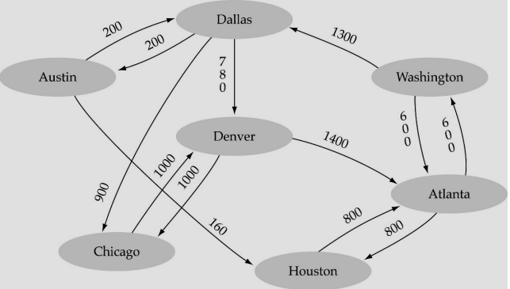

# Topic:

Directed Graph

## Task 1:

Write the C++ code to perform the graph data structure implementation for below scenario.

Use any Array based or link list based method for the implementation of the graphs in the
C++
Your implementation should have following functions

1. Create graph
2. Display graph
3. Search edge between two vertices
